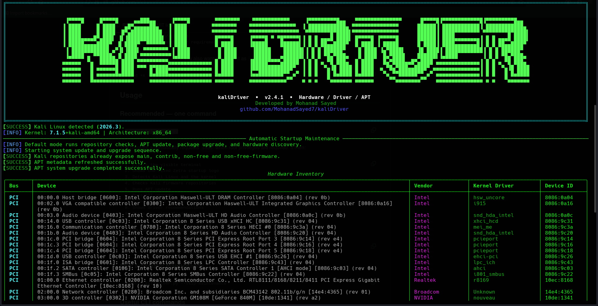

# kaliDriver

**Professional Hardware, Driver & APT Assistant for Kali Linux**

`kaliDriver` is a terminal-based Kali Linux utility built with Python and Rich. It focuses on hardware discovery, kernel-driver status, firmware/package assistance, and safe system maintenance.

## Screenshot

### Startup & Hardware Inventory



## What It Does

- Detects PCI and USB hardware with `lspci` and `lsusb`.
- Reports the active PCI kernel driver and advertised kernel modules.
- Flags PCI devices with no active driver instead of treating every `Unknown` value as an error.
- Separates unbound devices from devices where no driver/module was reported.
- Maps detected hardware to targeted driver/firmware profiles where a safe mapping is known.
- Provides APT repository checks and repair for Kali's firmware components.
- Runs `apt update`, `apt upgrade`, and optional `full-upgrade` workflows.
- Provides network-interface and storage inventory.
- Uses Rich tables, panels, progress indicators, and colored status messages.
- Never installs a driver automatically just because a device was detected; installation requires an explicit user confirmation.

## Main Menu

```text
[1] Hardware Diagnostics
[2] System Maintenance
[3] Driver & Firmware Manager
[4] System Information
[0] Exit
```

### 1. Hardware Diagnostics

Performs a hardware scan and reports:

- PCI devices
- USB devices
- Vendor and device IDs
- Active kernel driver
- Advertised kernel modules
- Network interfaces
- Storage devices
- Driver issues requiring attention

### 2. System Maintenance

Provides:

- APT repository status
- Kali firmware repository repair
- APT metadata refresh
- Package upgrade
- Update + upgrade

### 3. Driver & Firmware Manager

This is the hardware-first part of `kaliDriver`.

The manager scans first and then shows only detected driver issues. For example:

```text
Driver Issues Detected

#  Device                         Status                    Current Driver  Recommendation
1  Broadcom ...                   MISSING_DRIVER            Unknown         Broadcom Wireless Firmware
2  NVIDIA ...                     MODULE_AVAILABLE_NOT_BOUND nouveau         NVIDIA GPU Driver
```

The tool then shows the installation plan and asks for confirmation before changing packages.

### 4. System Information

Displays Kali version, kernel, architecture, Python version, APT availability, scanner availability, and log location.

## Installation

Clone the repository:

```bash
git clone https://github.com/MohanadSayed7/kaliDriver.git
cd kaliDriver
```

Create a virtual environment:

```bash
python3 -m venv .venv
source .venv/bin/activate
pip install -r requirements.txt
```

## Usage

Recommended one-command mode:

```bash
python3 kaliDriver.py
```

The program requests `sudo` when root privileges are required.

If you prefer direct execution:

```bash
chmod +x kaliDriver.py
./kaliDriver.py
```

### Useful options

```bash
python3 kaliDriver.py --scan
python3 kaliDriver.py --diagnose
python3 kaliDriver.py --repo-check
python3 kaliDriver.py --update
python3 kaliDriver.py --upgrade
python3 kaliDriver.py --update-upgrade
python3 kaliDriver.py --dry-run
python3 kaliDriver.py --skip-maintenance
```

## Safety Model

`kaliDriver` uses detection before recommendation. A device is not considered broken merely because a text field says `Unknown`. PCI driver status is based on the kernel-driver information reported by `lspci -nnk`.

Driver installation is always an explicit action. The tool shows the selected profile and package plan before asking for confirmation.

## Kali APT Compatibility

Kali's current documentation uses the deb822 repository file `/etc/apt/sources.list.d/kali.sources` with `main contrib non-free non-free-firmware`; older installations may still use `/etc/apt/sources.list`. `kaliDriver` checks both formats.

## Project Structure

```text
kaliDriver/
├── kaliDriver.py
├── README.md
├── CHANGELOG.md
├── LICENSE
├── requirements.txt
├── pyproject.toml
├── .gitignore
└── docs/
    └── images/
        └── kaliDriver-startup.png
```

## Author

**Mohanad Sayed**

GitHub: https://github.com/MohanadSayed7/kaliDriver

## License

See [LICENSE](LICENSE).
